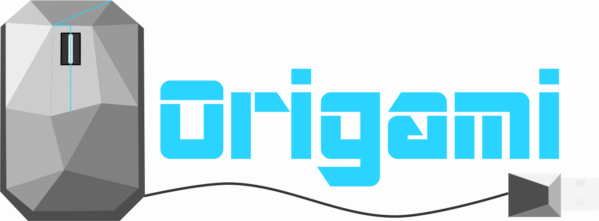

 
 
 
 
 

<h4 align="center">Artificial Intelligence as a Service</h4>

- Origami is an AI-as-a-service that allows researchers to easily convert their deep learning models into an online service that is widely accessible to everyone without the need to setup the infrastructure, resolve the dependencies, and build a web service around the deep learning model. By lowering the barrier to entry to latest AI algorithms, we provide developers, researchers and students the ability to access any model using a simple REST API call.

- The aim of this project is to create a framework that can help people create a web based demo out of their machine learning code and share it. Others can test the model without going into the implementation details. Usually testing models by other people involves a lot of preparation and setup. This project aims to cut that down.

This app is presently under active development and we welcome contributions. Please check out our [issues thread](https://github.com/Cloud-CV/Origami/issues) to find things to work on, or ping us on [Gitter](https://gitter.im/Cloud-CV/Origami).

# Installation Instructions

## Development Setup for Contributors
** This application will require: **
* [NodeJS v5+](https://nodejs.org/)
* [Docker](https://www.docker.com/products/docker-desktop)
* [PostgreSQL](https://www.enterprisedb.com/downloads/postgres-postgresql-downloads)
* [Python 2.7/3.4+](https://www.python.org/downloads/)

## Create A Virtual Environment
Virutal environments help with contributing code because it isolated your local packages from others that might be used in the project. To begin the installation of the application for contributions, we will create a virtual environment.
1. `pip install virtualenv`
2. `virtualenv venv` This __venv__ is the name of the environment and can be whatever you'd like. This creates a folder that will be called `venv` which you can now navigate to.
3. Activate the virtual environment by running `Scripts/activate`

## Getting Code and Dependencies

Now we will grab the code from Github for local development. Start out by navigating to the root of your virtual environment.
1. Clone this repository by `git clone https://github.com/Cloud-CV/Origami`
2. Navigate into the directory by `cd Origami/`
3. Origimal comes with some packages that will require dependencies for Python. To install them in your local environment, `pip install -r requirements.txt`
4. There are also NodeJS dependencies. Preferable use `yarn` or `npm install` to install these dependencies.
5. Using Docker, setup redis by running `docker run -d -p 6379:6379 --name origami-redis redis:alpine`

## Environment Variables

Next we will setup the environment variables for the development environment. To do this, you should see that the git clone copied `origami.env.sample`. Rename this file `origami.env` and follow the following steps to set the environment up properly. Ensure that you have a PostgreSQL and a database created already.
1. `HOST` should be set to the host name of the server ("in most cases, 'localhost') can be used.
2. `PORT` should be set to an available port on your machine (It is recommended you use 80)* 
3. `DB_Name` refers to whatever the database's name is that you created
4. `DB_PASS` password for the database's admin creator
5. `DB_USER` username for the database's admin creator
6. `DB_USER_EMAIL` email for the database's admin creator
7. `DB_HOST` Should be set to localhost in development and PostgreSQL in production
8. `REDIS_HOST` should be set to redis and localhost in development

Also edit the `Origami/outCalls/config.js` file variables for store configuration
1. `CLIENT_IP` should be set to the same value as `HOST` in `origami.env`
2. `CLIENT_PORT` should eb set to the same value as `PORT` in `origami.env`
3. For `DROPBOX_API_KEY`, check 3 of [__Configuring Origami__](https://cloudcv-origami.readthedocs.io/en/latest/web-app.html#configuration)

## Setting Up The Database

### Create all the tables
Create copy of data to be migrated to database 
` python manage.py makemigrations`

Actually migrates data to database
`python manage.py migrate`

### Create Admin Account
`python manage.py initadmin`

### Start Server
1. Start the server by: `python manage.py runserver --noworker`
2. Start the worker by `python manage.py runworker`
3. Start frontend with `yarn run dev`
4. Navigate to [localhost:8000](localhost:8000) to view the page

** For furthur instructions, visit [Read the Docs](https://cloudcv-origami.readthedocs.io/en/latest/) in the "Getting Started" section

## Contributing to Origami

1. Before pushing your code, be sure to run tests using
    * `python manage.py test`
    
    * `yarn run test`
    
2. Fix linting issues in code:
    * `yarn run lint:fix`

## License

This software is licensed under GNU AGPLv3. Please see the included `License` file. All external libraries, if modified, will be mentioned below explicitly.
