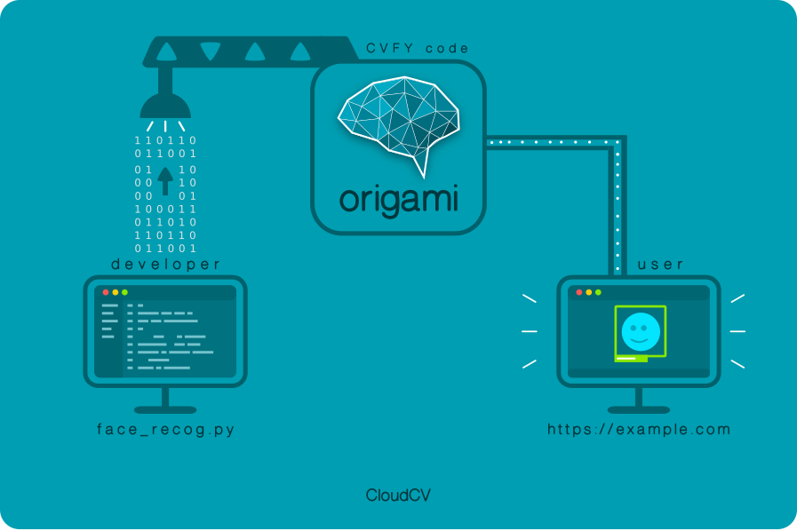

# Origami

<p align="center"></p>

[](https://travis-ci.org/Cloud-CV/cvfy-frontend.svg?branch=master)
[](https://coveralls.io/github/Cloud-CV/Origami?branch=master)
[](https://david-dm.org/Cloud-CV/cvfy-frontend)
[](https://david-dm.org/Cloud-CV/cvfy-frontend#info=devDependencies)
[](https://github.com/prettier/prettier)

- Origami is an AI-as-a-service that allows researchers to easily convert their deep learning models into an online service that is widely accessible to everyone without the need to setup the infrastructure, resolve the dependencies, and build a web service around the deep learning model. By lowering the barrier to entry to latest AI algorithms, we provide developers, researchers and students the ability to access any model using a simple REST API call.

- The aim of this project is to create a framework that can help people create a web based demo out of their machine learning code and share it. Others can test the model without going into the implementation details. Usually testing models by other people involves a lot of preparation and setup. This project aims to cut that down.

This app is presently under active development and we welcome contributions. Please check out our [issues thread](https://github.com/Cloud-CV/Origami/issues) to find things to work on, or ping us on [Gitter](https://gitter.im/Cloud-CV/Origami).

## Getting Started

### Setting the environment variables

* `origami.env` stores all the environment variables necessary to run Origami.

1. `HOST` should be set to the hostname of the server
2. `PORT` should be set to the port you want the server to listen on. (Generally 80)
3. `DB_NAME` will be used to set the name for your postgres database
4. `DB_PASS` will be used to set the password for the database user. This is also the admin password
5. `DB_USER` is the username for a user who can modify the database. This is also the admin username
6. `DB_USER_EMAIL` stores the email for the admin
7. `DB_HOST `should be set to postgres in production and localhost in development
8. `REDIS_HOST` should be set to redis and localhost in development

To create the file, `cp origami.env.sample origami.env` and edit the file with the above fields.

* For adding Dropbox support for uploading images check step 3 of [configuring Origami](http://cloudcv-origami.readthedocs.io/en/latest/web-app.html#configuration) 

## Production setup instructions 

**Use docker to setup Origami on production**

### Running the server

You can run the server with the help of docker and docker-compose.

Run  `docker-compose up`

## Development setup instructions

**This application requires node v5+ and Python 2.7/3.4+**

### Create a Virtual Environment

1. `pip install virtualenv`
2. `virtualenv venv` venv = Name of virtualenv
3. `source venv/bin/activate`

**Note: Step 2 will create a folder named venv in your working directory**

### Getting the code and dependencies

1. Clone this repository

2. Navigate to the repo. Usually `cd Origami/`

3. Add all the python dependencies.
   `pip install -r requirements.txt` 

4. Add all the javascript dependencies
   `yarn` (preferably) or `npm install`

5. Setup redis 
   `docker run -d -p 6379:6379 --name origami-redis redis:alpine`

6. Setup the environment

   `source origami.env`

### Setting up the database

#### Create all the tables

```
python manage.py makemigrations
python manage.py migrate
```

#### Create admin account

`python manage.py initadmin`

### Start the server

1. Start the server by `python manage.py runserver --noworker`
2. Start the worker by `python manage.py runworker`
3. `yarn run dev`
4. Go to [localhost:8000](http://localhost:8000/)
  Visit [Read the docs](http://cloudcv-origami.readthedocs.io/en/latest/) for further instructions on Getting started

### Contributing to Origami

1. Make sure your run tests on your changes before you push the code using:
	* `python manage.py test`
	* `yarn run test`

2. Fix lint issues with the code using:
	* `yarn run lint:fix`

## License

This software is licensed under GNU AGPLv3. Please see the included `License` file. All external libraries, if modified, will be mentioned below explicitly.
